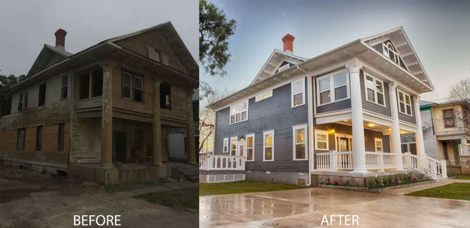
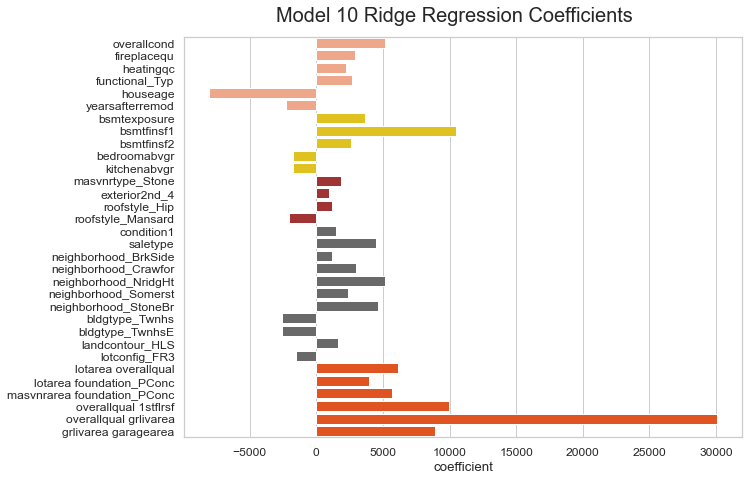

# Building a Price Prediction Model for Houses in Ames, Iowa
### Business Development of House-flipping Consultancy Business in the region of Iowa

House flipping - the lucrative process of finding great housing deals, fixing them and eventually selling them at a better price, is gaining popularity in the United States. House flippers who manage to find a deeply discounted house in disrepair, can make anywhere from [USD 40K to USD70K](https://morrisinvest.com/blog/2019/4/15/the-truth-about-flipping-houses/?gclid=CjwKCAjwkJj6BRA-EiwA0ZVPVrGS2375XD-hXjQLIAelMNja7R-T_J5Wz5Qh1_clsL0DCyhkG2Qk2hoCtZUQAvD_BwE) in a single transaction. 

Iowa is a sellers' market with an overall increase in house prices in 2018 [3.9%](https://listwithclever.com/real-estate-blog/the-ultimate-guide-to-flipping-houses-in-iowa/) and an [overall increase in number of houses sold](https://www.iowarealtors.com/news/2019-iowa-real-estate-market-finishes-strong-sales-up-prices-up). Year-on-year increase in number of home sales was a staggering [9.4%](https://www.amestrib.com/business/20200220/ames-real-estate-market-snapshot#:~:text=This%20was%20an%20increase%20of,in%202019%2C%20which%20was%20%24253%2C137.&text=The%20median%20price%20also%20increased,2020%20and%20%24225%2C000%20in%202019.) for Ames, Iowa. Moreover, Iowa has one of the [top 50 cities](https://q923fm.com/iowa-city-named-in-top-50-best-places-to-flip-a-house/) for profitting off a house flip, due to its cheap renovation and remodeling costs. According to research, each flip is averages around [USD 53,962 in revenue](https://newsilver.com/the-lender/flipping-houses-in-iowa/). 

### *This is the power of house flips!*

# Problem Statement

HouseInc, a boutique real-estate consultancy that specialises in assisting home owners and retail investors in their efforts to participate in house flipping investment activities, as well as passive real-estate investments. HouseInc has achieved broad success in their consultancy services in other Midwestern states, and has decided to broaden their services and expand their reach to neighbouring state, Iowa, due to its increasing demand in house purchases and stable rise in real estate prices. HouseInc is starting off its expansion in the region with Ames, a city in Iowa.

As a senior consultant in the team, my task is to perform data exploration and design a house price prediction model for our business development team. The business case for this project are detailed below:
1. Data exploration of past real estate transactions in the Ames, Iowa region, would help us to understand the geographical discrepancy in home prices, and which estate to focus on when we search for houses with deep discounts. 
2. A mathematically-backed prediction model to share with our potential clients regarding our analysis of home prices, based on their budget, preference and agenda. 
3. Provide useful and sound advice to clients intending to renovate their house for the purpose of selling them at for higher returns. 
4. Have a good understanding of which materials/styles that house owners prefer in this region through the model so that sourcing for contractors will be more targeted, and potentially cheaper. 

Our business profits by taking a commission from each successful house flip (10%) and a consultation charges for investors. 

In every house flipping exercise, the first step is always to find the best deal possible. Our regression model can help us:
   1.  confirm if the house is selling below its fair value/at a discount; 
   2.  identify attributes to modify the house for us to maximise the house prices; 
   3.  determine the fair value of the house post-renovations;
   4.  understand which kind of house we should be targeting

# Executive Summary

Housing market activities has been on the rise in the Iowa region. HouseInc, a boutique real-estate consultancy specialised in house flipping activities, is gearing up to enter the market. Analysts in the company is currently working to build a precise sale price prediction model for core business development purposes. 

From a comprehensive dataset with four years of data regarding house sales in the Ames region, we have conducted data preparation, data cleaning, exploratory data analysis, and modelling to prepare for the most suitable price prediction model. 

We have come up with a Ridge regression model that consist of 32 variables. The performance of the model amounted to an R^2 of 0.9263 and Kaggle RMSE of 24,843. 

We would recommend our house flipping investors to act on the following:
- Purchase a house in April and sell the house by in June/July (within a year/next year) 
- Choose a house that is spacious but poor quality at a low price point. 
- Be wise with the materials and styles chosen when renovating the house. 
    - Preference for concrete foundation, hip-styled roof, metal exterior covering and more.
- Essential to renovate to a really good quality as quality is a key factor in pushing prices up.

# Content (Part 1)

The data used for this project are:
- [Ames House Price Training Dataset](https://www.kaggle.com/c/dsi-us-6-project-2-regression-challenge/data)
- [Ames House Price Testing Dataset](https://www.kaggle.com/c/dsi-us-6-project-2-regression-challenge/data)

Due to the scale of this project, I have seperated my process into two seperate notebooks:
#### Part 1 - Data Preparation
- [1A Data Preparation](#1A-Data-Preparation)
- [1B Data Cleaning](#1B-Data-Cleaning)
- [2A Correlation - Multi-collinearity](#2A-Correlation:-Multi-collinearity)
- [2B Correlation of X Variables against Saleprice](#2B-Correlation-of-X-Variables-against-Saleprice)

#### Part 2 - Regression & Summary
- [3 Preparation of Data for Modelling](#3-Preparation-of-Data-for-Modelling)
- [4 Regression Modelling](#4-Regression-Modelling)
    - Model 1: Regression with All Regressors (Top-down Filtering)
    - Model 2: Dropping columns that have been made zero by lasso regression in Model 1 (Top-down Filtering)
    - Model 3: Top 40 ranked Absolute Lasso Coefficients Based on Model 1 (Bottom-up)
    - Model 4: Top 20 ranked Absolute Lasso Coefficients Based on Model 1 (Bottom-up)
    - Model 5: Tuning Model 2 to remove multi-collinear variables (Top-down Filtering)
    - Model 6: Picking Regressors with the Highest Correlation to Saleprice (Bottom-up)
    - Model 7: Using Statistic Summary to Remove Regressors from Model 5 (Top-down Filtering)
        - Model 7A: Tuning Model 5 - Removal of Statistically Insignificant Variables (high p-values)
        - Model 7B: Tuning Model 5 - Removal of Variables with High Standard Errors
        - Model 7C: Tuning Model 5 - Removal of Variables that are statistically insignificant or has high standard errors
- [5 Interaction and Polynomial Variables](#5-Interaction-and-Polynomial-Variables)
    - Model 8A: Including the four interaction terms on top of Model 7A
    - Model 8B: Including the List of Filtered Interaction Terms on top of Model 8A
    - Model 9: Further fine-tuning of Model 8B using statistical evaluation
        - Model 9A: Tuning Model 8B - Removal of Statistically Insignificant Variables (high p-values)
        - Model 9B: Tuning Model 8B - Removal of Variables with High Standard Errors
        - Model 9C: Tuning Model 8B - Removal of Variables that are statistically insignificant or has high standard errors
    - Model 10: Fine Tuning Model 9A
        - Model 10A: Removal of regressors that were 'eliminated' by lasso regression
        - Model 10B: Removal of regressors due to MLR assumption evaluation
- [6 Preparing Test Data for Price Prediction](#6-Preparing-Test-Data-for-Price-Prediction)
- [7 Model Predictions](#7-Model-Predictions)
- [8 Kaggle Submissions & Results](#8-Kaggle-Submissions-&-Results)
- [9 Conclusions and Summary](#9-Conclusion-and-Summary)

# Selection of Model

### Model 10 is selected as it best fit our business purpose. This model is selected after testing 17 other models.
- Ridge Model 10 Test R2:  0.9263
- Ridge Model 10 Test Predicted Saleprice: 180891.58

**Kaggle Submission for Model 10 (Scores):**
- Public: 24,844
- Private: 32,036

# Data Dictionary

|Feature|Type|Description|Class|
|-|-|-|-|
|**overallcond**|*integer*|Overall condition rating|Quality|
|**fireplacequ**|*integer*|Fireplace quality|Quality|
|**heatingqc**|*integer*|Heating quality and condition|Quality|
|**functional_Typ**|*string*|Home functionality rating: Typical Functionality|Quality|
|**houseage**|*float*|Age of house (From year build to sold date)|Quality|
|**yearsafterremod**|*float*|Years after remodelling the house|Quality|
|**bsmtexposure**|*integer*|Walkout or garden level basement walls|Area|
|**bsmtfinsf1**|*float*|Type 1 finished square feet|Area|
|**bsmtfinsf2**|*float*|Type 2 finished square feet|Area|
|**bedroomsabvgr**|*integer*|Number of bedrooms above basement level|Area|
|**kitchenabvgr**|*integer*|Number of kitchens|Area|
|**masvnrtype_stone**|*string*|Stone material for Masonry veneer|Stylistic|
|**exterior2nd_4**|*string*|Exterior covering on house is metal|Stylistic|
|**roofstyle_Hip**|*string*|Hip style rooftop|Stylistic|
|**roofstyle_Mansard**|*string*|Mansard style rooftop|Stylistic|
|**condition1**|*integer*|Proximity to main road or railroad|Others|
|**saletype**|*string*|Type of sale|Others|
|**neighborhood_BrkSide**|*string*|Physical Location: Brookside|Others|
|**neighborhood_Crawfor**|*string*|Physical Location: Crawford|Others|
|**neighborhood_NridgHt**|*string*|Physical Location: Northridge Heights|Others|
|**neighborhood_Somerst**|*string*|Physical Location: Somerset|Others|
|**neighborhood_StoneBr**|*string*|Physical Location: Stone Brook|Others|
|**bldgtype_Twnhs**|*string*|Townhouse Inside Unit|Others|
|**bldgtype_TwnhsE**|*string*|Townhouse End Unit|Others|
|**landcontour_HLS**|*string*|Significant slope from side to side (Flatness of property)|Others|
|**lotconfig_FR3**|*string*|Lot configuration: Frontage on 3 sides of property|Others|
|**lotarea overallqual**|*interaction term*|Lot size in square feet (Lot area) & Overall material and finish quality (Overallqual)|Quality & Area|
|**lotarea foundation_Pconc**|*interaction term*|Lot size in square feet (Lot area) & Poured Concrete (Foundation foundation_Pconc)|Quality & Area|
|**masvnrarea foundation_Pconc**|*interaction term*| Masonry veneer area in square feet (Masvnrarea) & Poured Concrete Foundation (Foundation foundation_Pconc)|Quality & Area|
|**overallqual 1stflrsf**|*interaction term*|Overall material and finish quality (Overallqual) & First Floor square feet (1stflrsf)|Quality & Area|
|**overallqual grlivarea**|*interaction term*|Overall material and finish quality (Overallqual) & Above grade (ground) living area square feet (grlivarea)|Quality & Area|
|**grlivarea garagearea**|*interaction term*|Above grade (ground) living area square feet (grlivarea) & Size of garage in square feet (garagearea)|Quality & Area|

# Conclusion & Summary

### Evaluation

1. Of all the regressors in our regression model, the factors that affect salesprice the most is the the size & quality (combined) factor.
    - ie. Big and quality houses will fetch a disproportionally higher premiums than small/poor-quality houses.
    - This also means that individually, having a big house or a good quality house itself will not bring in the premiums.
    - Business Evaluation: This shows us that if we purchase a big house of poor quality, and renovate it such that the quality improves, this will fetch us a much higher profit from the house.
2. Second to the size/quality factor is the quality factor of the house. 
    - Houseage, which is indicative of the quality of the house, is highly correlated to the saleprice of the house. 
    - However, it is possible to offset this negative factor by introducing more positive factors to our house, ie. renovations, material changes, quality improvements etc.
3. Neighbourhood and Building types of houses moderately impact the saleprice of houses. 
    - Prime neighbourhoods appear to be NridgeHt, StoneBr, Crawfor and Somerst in descending order (NridgeHt is the most premium). 
    - Townhouses are generally less demanded and fetch a lower price in the market. 
4. There are a few materials that are preferred over others. However, tweaking other factors (mentioned above) will bring a higher saleprice.
    - Masvnrtype = Stone is preferred. 
    - Roofstyle = "Hip" is preferred over Roofstyle = "Mansard"

### Conclusion:

Recommendations to our clients are on a case-by-case basis. There is no one-size-fits-all solution to a dynamic problem like house flipping and investing exercises. However, these are some generic recommendations suitable for different kinds of clients:

**For retail investors:** Buy-and-Hold strategy
1. To invest in a house that is generally situated around the prime neighbourhoods (NridgeHt, StoneBr, Crawfor and Somerst).
2. Ideally, purchase a bigger house and renovate towards the end of your investment to improve quality of the house. This will bring a disproportionally bigger premium in the market. This will also help with the 'years after renovation" considerations that buyers have. 
3. A downside to the buy-and-hold strategy is that the houseprices also decrease disproportionally due to the increased age of house. To buffer the decrease in premiums, we should be mindful of the materials we choose when renovating the house near full-term.
    - A foundation material of Poured Contrete alongside a large houses (masonry/lotarea) is highly preferred by buyers.
    - General preference hip-styled roof than mansard-styled roof. However, renovations for rooftops often come with a heavy price tag, hence we need to weigh the trade-offs and see if it is still worth it.

**For house-flippers:** Buy-Flip-Sell strategy
1. Location will not be a big concern for an ultra-short term investment, as location-based premiums generally rises in the long-run due to changes in demographic, amenenities etc. 
2. The same goes to "Houseage" as a factor in price determination, as an ultra-short term investment will not affect the 'houseage' factor which is predicted to depress prices. 
    - Contrary, renovations done within the investment holdings period will set 'years after renovations" to be 0. This also lift prices. 
2. The key to a successful flipping strategy is to buy-low and sell-high. Hence, finding a good house at a low price is essential in this strategy.
3. A key to success is also the size of the house. 
    - Our model suggest that houses that are big and extremely poor in quality will depress prices by a significant amount. Hence, buying them at a low price is plausible. This also suggest that the strategy of renovations will work well based on our model prediction.
    - Preferably, find a house that has a garage and basement. These are elements of houses that lift prices. 
4. Similar to the buy-and-hold strategy, we should be really mindful in the materials chosen for our renovation work. Suggestions for desirable materials are listed above (in the buy-and-hold strategy). 
5. Purchase house in April (due to lowest mean saleprices) and sell house in June-July (due to highest sales activities).

### How to improve our model

1. House transaction data were collected over four years, from 2006 to 2010, based on 'yrsold' data from our train model. 
    - As we are working towards expanding our presence in the Ames, Iowa region in year 2020, the data collected is deemed to be outdated for present day modelling. Many factors would have changed post-2010, including neighbourhood amenities changes, demographic changes, taste & preferences of consumers etc. 
    - Data showed that 2010 house sales have dipped in numbers compared to all other years. However, we do not have sales data for 2010-onwards. A systematic shock to the economy in the 2008 global financial crisis may cause house prices to be depressed for a long time, and we do not know how it has affected current sale prices as a result of this crisis. 
2. Data Requests - Some other details that would be helpful for our analysis would be:
    - Transportation facilities nearby: Number of Buses in 500m vicinity, Distance to nearest train station
    - At least 10 years of transaction data
    - Demographic group of each neighbourhood and each building type (in a seperate dataframe)

*Footnote: Both HouseInc and its business case mentioned above are fictional.*

