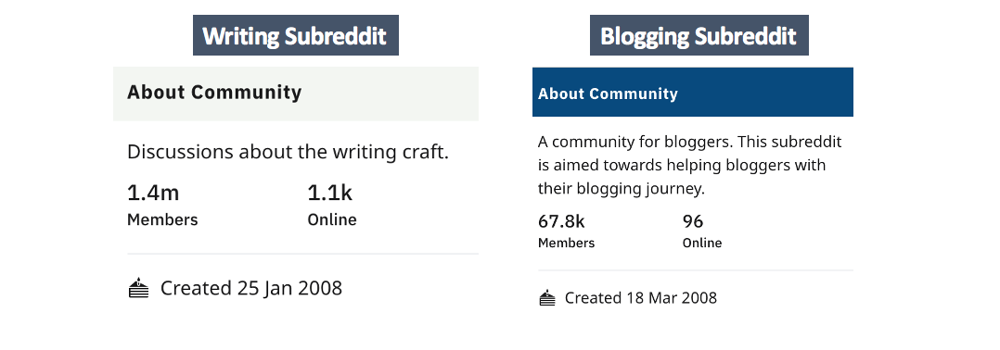
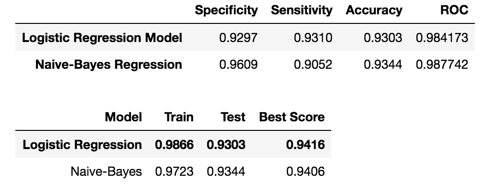
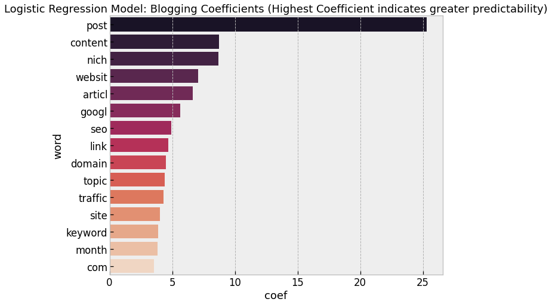
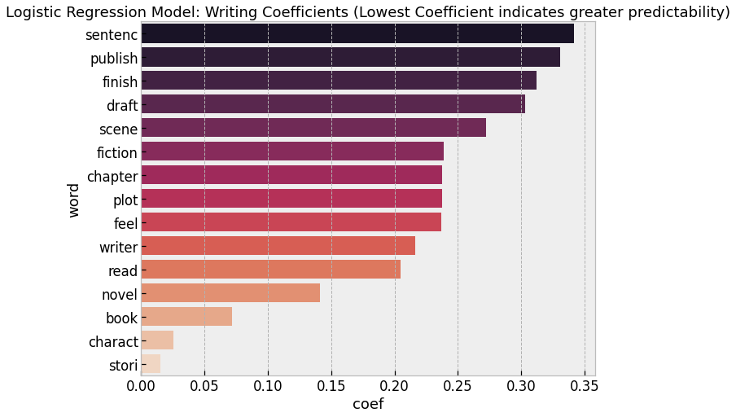

# Subreddit Classification: Writing & Blogging

##### What is blogging?
A blog (a truncation of "weblog") is a discussion or informational website published on the World Wide Web (www) consisting of discrete, often informal diary-style text entries (posts). [Source](https://en.wikipedia.org/wiki/Blog)
Blogging refers to writing, photography, and other media that's self-published online.
[Source](https://www.thebalancesmb.com/blogging-what-is-it-1794405)

##### What is writing?
Writing is a medium of human communication that involves the representation of a language with symbols. Writing systems are not themselves human languages (with the debatable exception of computer languages); they are means of rendering a language into a form that can be reconstructed by other humans separated by time and/or space.
[Source](https://en.wikipedia.org/wiki/writing)

***In other words, a blogger is also a writer, who writes in the internet through weblogs ('blogs'). However, writing is an art itself, which emphasise the communication through languages. A writer could write anywhere (newspapers, books, magazines, emails, blogs etc.).***

### Blogging and Writing Subreddit Groups
Blogging and Writing subreddit groups are very similar in nature. Both are communities that are focused on writing.

- However, the size of the communities differ, with 67.7K users in the Blogging subreddit, whereas Writing subreddit has 1.4M users.
- Based on the following image, we can conclude that the Writing subreddit is far more active than Blogging subreddit, with 1.1k users online at the point of snapshot, and only 96 online for blogging.
- Lastly, both of these groups were created at around the same period of time, in Q1 2008.

# Business Case
As a data scientist in Alytics under the Internet team, our client base mainly works with online influencers and youtubers to improve their views on their posts.

A rising trend in the market is for Bloggers to improve their views on their posts through the use of analytics. A subset of this trend is the rise of Reddit as a virtual community for bloggers to ask questions and seek guidance from like-minded individuals.

Our team is working on a long-term project targeted to assist bloggers to improve their views on their blog. The first phase of this project would be targeted at the Reddit platform, where bloggers often visit for idea sharing, feedbacks and questions. 
- **Phase A Part 1**: Create a classifying tool to help bloggers to post their questions and experiences in the correct Subreddit group. The two subreddits that bloggers are commonly confused with are Blogging and Writing.**(Current Project!)**
- **Phase A Part 2**: We will look into Subreddit analytics to understand how to structure a reddit post to maximise views and activities (ie. upvotes, comments)
# Problem Statement
To create a text classifier to determine whether a reddit post created by a blogger would be best classified under the Subreddit groups "Blogging" or "Writing".
We will be measuring the success of our classifier model by looking at several metrics, including accuracy, specificity, sensitivity and model scores.
# Executive Summary
#### EDA
From our analysis, the Blogging subreddit group have a huge emphasis on their blog optimisation (common phrases that appear: SEO, traffic flow, keyword search etc.) and less on technical writing elements. However, the Writing subreddit group appears to be the opposite. Posts appear to be focused on writing techniques, with many users posting questions and seeking help for their stories (common phrases that appear: 'writing advice, don know, dont want, help writing, start writing').

In terms of overall tonality of the words/phrases that commonly appear in both subreddit groups, we can conclude Blogging subreddit group appears to be more formal and professional, whilst Writing subreddit group appears to be more casual and community-based. This could be due to the fact that Bloggers are more marketing/promotion oriented, whilst writers are more focued on the art of writing.

#### Modelling (Classification Model)

- For our text classifier, we chose to compare between two modelling tools: Logistic Regression and Naive-Bayes model.
- As seen from our model summary above, both models have performed similarly in predicting whether posts fall under the Writing or Blogging subreddit groups, with an accuracy of approximately 93%.
- From our Logistic regression, we were able to understand how our Logistic regression classify our posts based on the words appeared.
 

- Interestingly, words that are of greater importance in classfiying posts into the **Blogging** subreddit are: Posts, Content, Website, Niche, Article, Google, SEO, link etc (web-analytics oriented)
- Whereas words that are of greater importance in classfiying posts into the **Writing** subreddit are: story, character book, novel, read, writer, plot, feel, chapter etc. (traditional writing-oriented)

# Content
The two subreddits that I have scrapped my reddit posts from are:

- [Blogging](https://www.reddit.com/r/blogging/)
- [Writing](https://www.reddit.com/r/writing/)

[**Part 1**](https://github.com/alysesu/GA-Projects/blob/master/Project-3/Project%203%20-%201.%20Webscrapping.ipynb)

- Webscrapping

[**Part 2**](https://github.com/alysesu/GA-Projects/blob/master/Project-3/Project%203%20-%202.%20Data%20Cleaning%20%26%20EDA.ipynb)
- Exploratory Data Analysis
- Sentiment Analysis

[**Part 3**](https://github.com/alysesu/GA-Projects/blob/master/Project-3/Project%203%20-%203.%20Data%20Processing%20%26%20Modelling.ipynb)
- Preprocessing Text Data
- Modelling (Logistic Regression)
- Modelling (Naive-Bayes Modelling)
- Conclusion

# Conclusion
In conclusion, we are rather indifferent about both the Naive Bayes model or the Logistic Regression model in classifying our subreddit posts.
- Both models have achieved a similar accuracy scores, despite having differences in other metrics that we have identified.
- ROC curve also shown that Naive-Bayes and Logistic Regression is largely similar in performance.

### Limitations
- As I could only scrape approximately 500-600 posts per subreddit, I belive our model could be more accurate if we increase the number of posts in our training dataset so that the model can learn more through existing data. This has certainly inhibited part of the success of our model.

### Other useful information
- Overall sentiments for the Writing subreddit tend to be slightly lower than Blogging subreddit. However, both subreddit has a positive sentiment to it.
- This could be attributed to the level of 'professionalism' displayed in the Blogging subreddit. On the other hand, the Writing subreddit appears to be a community where writers post about their struggles and seek help. Hence, this could have pulled down our overall sentiment for Writing subreddit.

### Project Extension/Further Research
**Agenda:** To help our blogging clients to optimise their subreddit posts to maximise probability for increased views, upvotes and comments.
- To conduct predictive analytics on posts vs. number of comments and number of upvotes
- To scrape subreddit post comments and analyse sentiments.
