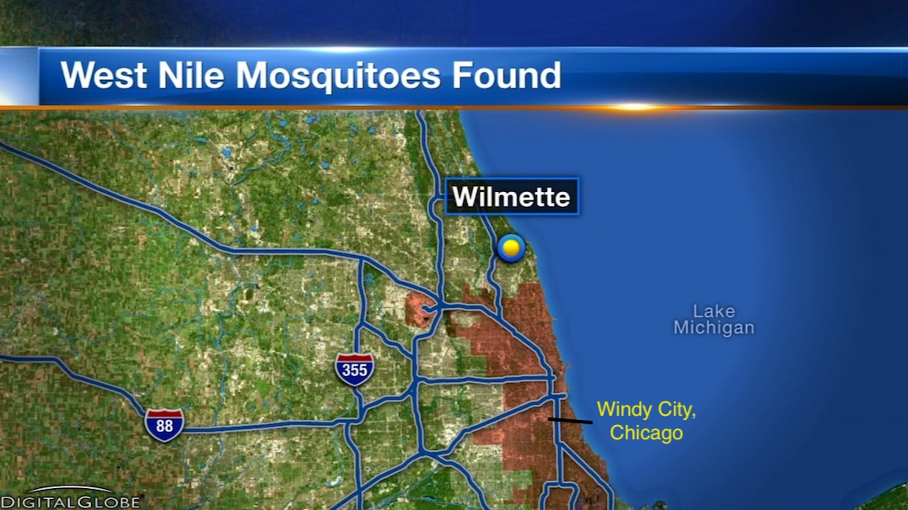
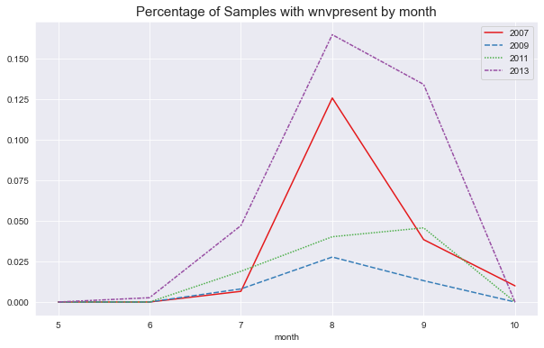
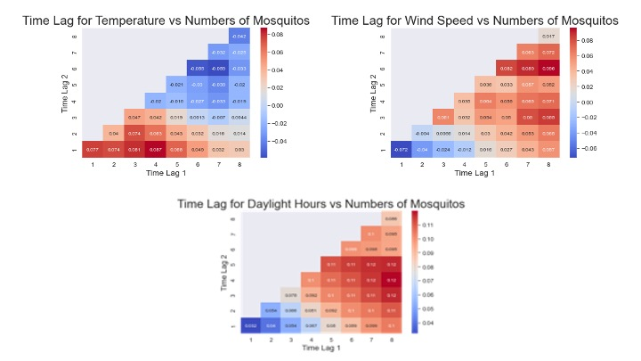
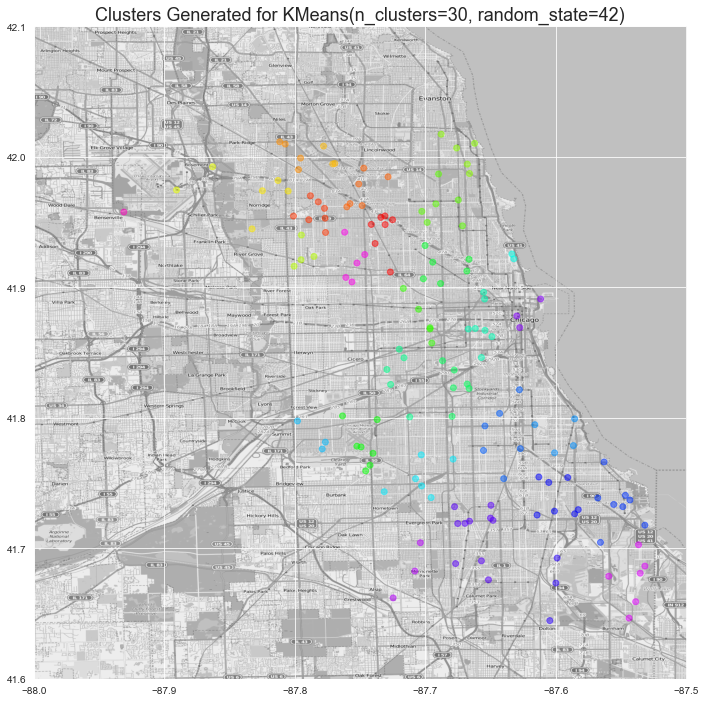
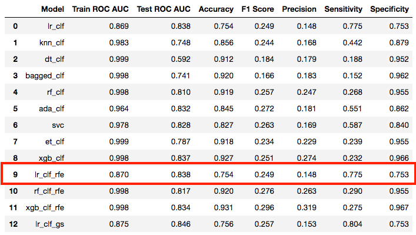
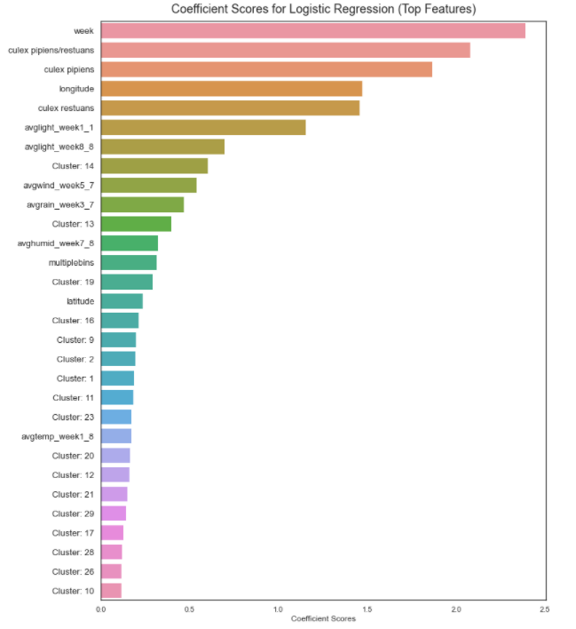

# Early Detection for West Nile Virus in Windy City, Illinois
### DSI-16 Project 4
By Alexis, Alyse, Dylan and Wei Tian
# Content
### Data Utilised
- **Train:** The training data consist of sample data from 2007, 2009, 2011, and 2013.
- **Test data:**  The test data are samples from 2008, 2010, 2012, and 2014 which we would need to predict.
- **Weather data:** Dataset from NOAA of the weather conditions of 2007 to 2014, during the months of the tests.
    - Supporting Documnet: Definitions and description for the weather dataset
- **Spray data:** The City of Chicago also does spraying to kill mosquitos. Spray data are only provided for year 2011 and 2013.

### Our project is split into three main notebooks:
#### Notebook 1:
   - Introduction, Business Case & Problem Statement
   - Executive Summary
   - Data Processing (Train/Test, Weather and Spray datasets)

#### Notebook 2:
   - Data Exploration (EDA)
   - Feature Engineering
   - Feature Selection

#### Notebook 3:
   - Data Modelling
   - Key Findings & Recommendations
   - Conclusion

#### (Supplementary) Notebook 3.5:
   - Additional Information on Modelling

# Introduction

West Nile Virus has been endemic to the area of Windy City, Chicago. In North America, cases of WNV occur during mosquito season, which starts in the summer and continues through fall. Across the country, 2,647 cases of WNV were reported in humans, and there were 167 (6.3%) confirmed deaths in 2018. This is a rather significant illness where death rate is consistently at about 5-7% every year, which is a huge cause for concern.

#### What is West Nile Virus?
West Nile virus is a serious disease most commonly spread by infected mosquitoes. Mosquitoes become infected when they feed on infected birds. Infected mosquitoes can then spread the virus to humans and other animals. Symptoms (see below) are usually mild, but in rare cases, severe illness including encephalitis (inflammation of the brain), meningitis (inflammation of the lining of the brain and spinal cord), or even death, can occur.

[Source](https://cookcountypublichealth.org/communicable-diseases/west-nile-virus/)

# Business Case
Disease and Treatment Agency, division of Societal Cures In Epidemiology and New Creative Engineering (DATA-SCIENCE). Our agency is a national public health institute in the United States. Our mission is to identify potential diseases in our country and counter the spread of these illnesses to promote the health and safety of our people.

Our team focus on the area of Chicago, and region  that is affected by the West Nile Virus every year during Summer. As the leading team of data scientist within this division, one of our goals is to identify potential areas for the presence of West Nile Virus, and recommend suitable actions to be taken at the right place, and right time.

Our overall agenda is to keep Chicago safe from the spread of West Nile Virus, and have a year-on-year decline in the number of people infected by this potentially lethal disease.

# Problem Statement

To create a predictive model for us to identify the **presence of WNV** at different locations, time of year and other factors in Windy City.

**Business goal:**
- Identify problem areas in Windy City ahead of time
- Suggest suitable remedies to prevent the spread of West Nile Virus in the region

# Executive Summary
The three main facets that best predicts the presence of West Nile Virus could be broken down into **Seasonality, Weather and Location**.
- **Seasonality:**
    - Our main predictive features are **day of year, week of year and month**.
    - We observe that the period of August, is the **main window period** for mosquitoes to carry the West Nile Virus.
    
- **Weather:**
    - Lagged and averaged weather data from different time periods in the past eight weeks (prior to sampling) proved to be a strong predictor for the presence of West Nile Virus.
    - Favourable lagged weather conditions include: temperature, legnth of day and wind speed.
    
- **Location**
    - Location features, such as **longitude and engineered cluster categories**, were also useful predictors for the presence of West Nile Virus.
    - We have concluded that mosquitoes appear to breed in certain 'hotspots' over the years, which may be a result of the physical conditions of the area, or the living habits of the population in the area.

#### Cluster Data as Displayed:
    

#### Overall Modelling Summary
Our best predictive model for the presence of West Nile Virus across Windy City is using the Logistic Regression model (RFE).

Below are the summary of top 30 coefficients that are most useful for predicting the presence of West Nile Virus in Windy City.

# Key Findings
### Cost:
- It cost approximately USD 25,000 to spray an area of 28 squared km by Vector Disease Control International, the provider for Chicago this year.
- Scaling appropriately, the cost would be about USD 540,000.

### Benefit
- 1 in 5 people infected with WNV develop West Nile fever and 1 in 150 people develop more severe symptoms
- In 2017, there were 90 WNV cases, including 8 deaths. Assuming the median household income in Chicago of USD 55,295 and an average hospital cost of USD 25,000 per patient, the cost was approximately USD 490,000.

### Analysis
It will not be economic to conduct spraying insecticide, given the lack of impact.

# Recommendations
- Insecticide spraying has not proven to be significant in reducing infection rates and requires more data and more campaigns for us to optimise its impact. In the meantime, we should also focus on other courses of action based on our findings.
- Prepare ahead of time to combat the West Nile Virus during the period it is most likely to occur and invest more resources in:
  - Public information campaigns to prevent behaviour that would lead to mosquitos breeding
  - Increased testing, especially of traps that have a high prevalence of infection and traps that are close to previously infected traps
- Focus on developing strategies specific to the two species Culex Pipiens and Culex Restuans e.g. releasing sterilised mosquitoes to breed with the mosquitos in the area.
- Leverage a predictive model based on weather data and past data, to predict the most infectious periods and prepare for outbreaks

# Conclusion

### Project Limitations
- We would have more insight into the course of action and performance of each model if we knew how our test data scores on different metrics: sensitivity, f1 score, accuracy etc., as currently, we are only able to score these by splitting our train data.
- With more data on weather for the whole year, we would be able to better create our averaged weather metrics as well as see overarching trends for each year.
The setup of the dataset (samples split into bins of 50) is not conducive to creating a model that predicts for WNV at each location as the datasets should be grouped by samples taken.

### In conclusion:
Overall, our model helped us to find the most predictive features and we can continue to use it to help the city to identify potential outbreaks. It will need to be combined with vigilant monitoring on the ground, particularly during high risk periods.
